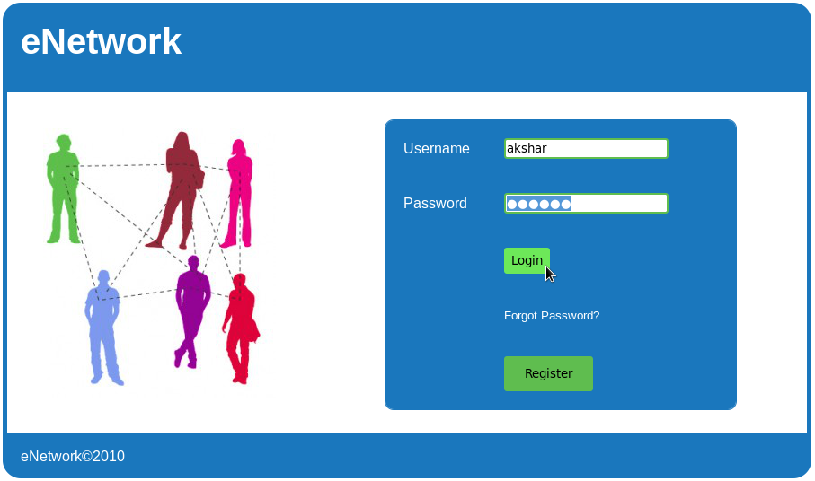
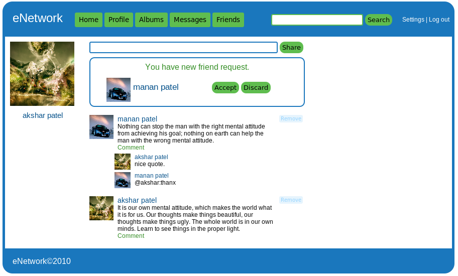
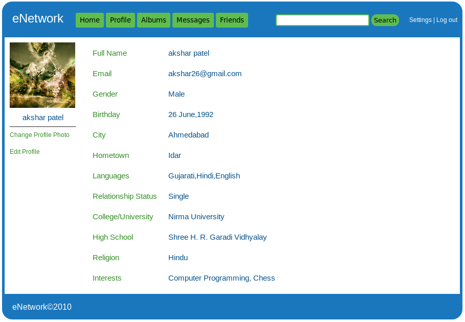
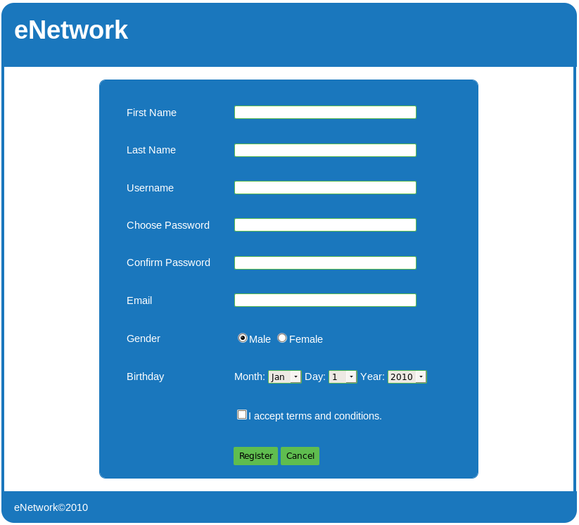

## eNetwork: Social Networking Website using Java Servlets and JSP
### A social networking website developed using Java Servlets and JSP which includes a news feed, sharing of posts, uploading photos and videos, commenting, and profile.

*  Technologies: Java, Servlets, JSP, AJAX, JavaScript, HTML, CSS
*  Tools: Netbeans, Glassfish Server, Aptana Studio, Fedora
*  Platform: Web Browser
*  Modules: Profile, Photos, Videos, Friends, Posts, Comments
*  Lines of Code: 17021
*  Month-Year: FEB-2011

### Screenshots

